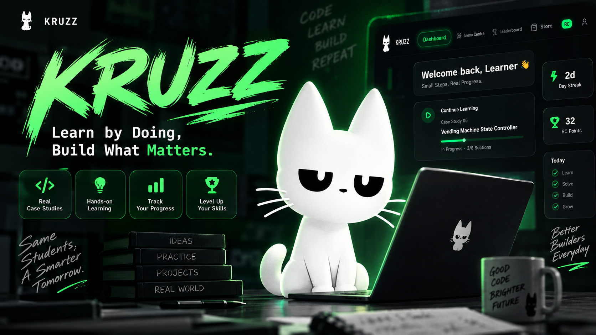
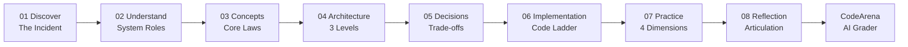
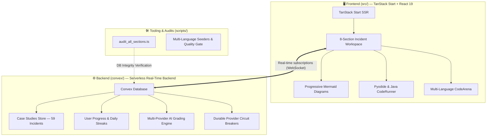

<p align="center">
  <a href="https://kruzz.indevs.in">
    
  </a>
</p>

<h1 align="center">KRUZZ</h1>

<p align="center">
  <strong>Interactive Real-World System Architecture & Distributed Systems Case Studies</strong><br>
  Reverse engineering tutorials: from real incidents to system mental models, progressive architecture, and code arenas.
</p>

<p align="center">
  <a href="https://github.com/RESKCORE/KRUZZ/stargazers"></a>
  <a href="https://github.com/RESKCORE/KRUZZ/network/members"></a>
  <a href="LICENSE"></a>
  <a href="https://github.com/RESKCORE/KRUZZ/actions/workflows/ci.yml"></a>
  <a href="https://kruzz.indevs.in"></a>
  <a href="https://react.dev"></a>
  <a href="https://tanstack.com/start"></a>
  <a href="CONTRIBUTING.md"></a>
</p>

<p align="center">
  <a href="https://kruzz.indevs.in"><strong>🌐 Launch Live App</strong></a> •
  <a href="public/SYSTEM_DESIGN_ROADMAP.md"><strong>📖 System Design Roadmap</strong></a> •
  <a href="#case-study-catalog"><strong>📚 59 Case Studies</strong></a> •
  <a href="#the-eight-section-case-study-method"><strong>The 8-Section Method</strong></a> •
  <a href="#quick-start"><strong>Quick Start</strong></a> •
  <a href="CONTRIBUTING.md"><strong>Contributing</strong></a>
</p>

---

## 🌟 What is KRUZZ?

Traditional tutorials teach programming from the bottom up: `Syntax → Exercises → Small Script`. But when students encounter real-world applications or system design interviews, they face a massive cognitive cliff:

> _"I know if/else and loops, but how does an image CDN route traffic? How does two-phase commit guarantee consistency across 10 database shards without deadlocking?"_

**KRUZZ reverses the starting point:**

$$\text{Real-World Crisis} \longrightarrow \text{System Understanding} \longrightarrow \text{Engineering Invariants} \longrightarrow \text{Progressive Architecture} \longrightarrow \text{Trade-off Decisions} \longrightarrow \text{Code Implementation} \longrightarrow \text{AI-Graded Lab}$$

| Traditional Tutorials                   | The KRUZZ Method                                                   |
| :-------------------------------------- | :----------------------------------------------------------------- |
| Starts with syntax in a vacuum          | Starts with a real-world outage or scaling crisis                  |
| Monolithic enterprise architecture dump | **Progressive Mermaid diagrams** revealed level-by-level           |
| "Just copy this library and framework"  | Answers: _Why does this exist? What breaks without it?_            |
| Multiple-choice quizzes                 | **Interactive multi-language CodeArena** with AI reasoning review  |
| Abstract theoretical diagrams           | Concrete code ladders mapping directly to architectural components |

---

## 📖 Featured Resource: Production System Design Roadmap

We have compiled a comprehensive, 400-line master reference and cheat sheet directly into the repository:

👉 **[Read the Full System Design Roadmap & Architecture Cheat-Sheet](public/SYSTEM_DESIGN_ROADMAP.md)**

### What's Inside:

- ⚡ **The Invariant Latency Numbers Every Systems Engineer Must Know** (L1 cache vs. NVMe vs. Cross-datacenter RTT).
- ⚖️ **CAP Theorem & PACELC** applied to production datastores (Dynamo, Cassandra, Postgres, Spanner).
- 🔀 **Traffic Routing & Consistent Hashing Rings** with virtual nodes and rebalancing math.
- 💾 **Distributed Caching Strategies** (Cache-Aside, Write-Through, Write-Behind, Stampede prevention).
- 🔄 **Distributed Transactions & Consensus** (2PC, Sagas, Raft, Paxos, Quorum reads/writes: $R + W > N$).
- 🛡 **Rate Limiting Algorithms** (Token Bucket, Leaky Bucket, Sliding Window Counter in Redis).
- 📡 **Telemetry & The Four Golden Signals** (Latency, Traffic, Errors, Saturation).

---

## 🗺 The 8-Section Case Study Method

Every case study in KRUZZ guides you through an identical, pedagogically rigorous sequence:



1. **01 — Discover the Problem**: Real-world incident or crisis before technical jargon (e.g. Black Friday flash sale melt).
2. **02 — Understand the System**: Component roles explained via **What is it? $\rightarrow$ Why does it exist? $\rightarrow$ What does it do?**
3. **03 — Engineering Principles**: Invariant computer science laws with real-world analogies, failure modes, and technical explanations.
4. **04 — Architecture Visualization**: **3 Progressive Mermaid diagrams** moving from high-level topology to end-to-end data flow to resilient failure paths.
5. **05 — Engineering Decisions**: Structured trade-off matrices answering _Why this? Alternatives? What happens without it?_
6. **06 — Step-by-Step Implementation**: Language-independent algorithm $\rightarrow$ progressive code ladder $\rightarrow$ fully annotated implementation.
7. **07 — Practice**: 4 multi-dimensional exercises: _Understand, Modify, Build, Think_.
8. **08 — Reflection**: Active articulation prompts requiring learners to explain design choices in their own words.
9. **Interactive CodeArena**: Live coding sandbox with test cases and AI multi-provider evaluation (Gemini, Groq, OpenRouter).

---

## 📚 Case Study Catalog (59 Production Investigations)

KRUZZ includes **59 comprehensive case studies** across 10 curriculum tracks, engineered for high-impact interview preparation:

### 🟢 Track 0: Foundations (OOP System Modeling) — _Free Tier_

_Designed for Machine Coding (LLD) interviews at Uber, Swiggy, Amazon, and campus placement drives:_

|   #    | Case Study                   | Core Concepts                                                      |  Level   | Target Round         |
| :----: | :--------------------------- | :----------------------------------------------------------------- | :------: | :------------------- |
| **01** | **ATM Machine**              | Hardware-software bridge, state machine, transaction atomicity     | Beginner | Machine Coding (LLD) |
| **02** | **Library Management**       | Relational references, resource allocation, inventory tracking     | Beginner | Machine Coding (LLD) |
| **03** | **Banking System Transfers** | Debit/credit balance invariants, double-entry ledgers              | Beginner | Machine Coding (LLD) |
| **04** | **Parking Lot Allocation**   | Space reservation, concurrency locks, pricing tiers                | Beginner | Machine Coding (LLD) |
| **05** | **Vending Machine States**   | Finite State Machine (FSM), currency validation, dispense timeouts | Beginner | Machine Coding (LLD) |
| **06** | **Seat Booking System**      | Double-booking prevention, optimistic concurrency, holds           | Beginner | Machine Coding (LLD) |
| **07** | **Inventory Stock Tracker**  | Replenishment thresholds, atomic counters, event notification      | Beginner | Machine Coding (LLD) |

### 🌐 Track 1: Web Systems & Edge Delivery

|   #    | Case Study                       | Core Concepts                                                  |    Level     | Target Round  |
| :----: | :------------------------------- | :------------------------------------------------------------- | :----------: | :------------ |
| **08** | **Client & Server Architecture** | HTTP request/response lifecycles, headers, REST, status codes  | Intermediate | System Design |
| **09** | **DNS Domain Lookup**            | Recursive resolution, authoritative name servers, TTL, Anycast | Intermediate | System Design |
| **10** | **Image CDN Delivery**           | Edge points of presence (PoPs), cache hit ratio, origin shield | Intermediate | System Design |
| **11** | **E-Commerce Cart & Checkout**   | Session affinity, idempotency keys, checkout reservation       | Intermediate | System Design |
| **12** | **Search Autocomplete**          | Trie data structures, prefix indexing, debounce, edge latency  | Intermediate | System Design |

### 🔐 Track 2: Security & Cryptographic Identity

|   #    | Case Study                          | Core Concepts                                                    |    Level     | Target Round    |
| :----: | :---------------------------------- | :--------------------------------------------------------------- | :----------: | :-------------- |
| **13** | **Authentication Fundamentals**     | Identity verification, credentials, bearer tokens, RBAC          | Intermediate | Security & Auth |
| **14** | **Password Hashing & Salts**        | Argon2id, bcrypt, rainbow tables, work factors, timing attacks   | Intermediate | Security & Auth |
| **15** | **API Keys & Secret Tokens**        | High-entropy random generation, hashed lookup, signature schemes | Intermediate | Security & Auth |
| **16** | **Two-Factor Authentication (OTP)** | HMAC-based (HOTP) vs. Time-based (TOTP), RFC 6238, drift windows | Intermediate | Security & Auth |
| **17** | **Session Tokens & Cookies**        | HttpOnly, SameSite cookies, JWT vs. stateful server sessions     | Intermediate | Security & Auth |

### 🗄 Track 3: Distributed Data & Storage

|   #    | Case Study                    | Core Concepts                                                     |    Level     | Target Round  |
| :----: | :---------------------------- | :---------------------------------------------------------------- | :----------: | :------------ |
| **18** | **High-Scale URL Shortener**  | Base62 encoding, distributed SnowFlake IDs, 301 vs. 302 redirects | Intermediate | System Design |
| **19** | **In-Memory Key-Value Cache** | LRU/LFU eviction, Redis architecture, cache stampede prevention   | Intermediate | System Design |
| **20** | **Database Indexing**         | B+ Trees, clustered vs. non-clustered indexes, write penalty      | Intermediate | System Design |
| **21** | **Cloud Data Deduplication**  | Content-addressable storage, cryptographic chunking (SHA-256)     | Intermediate | System Design |

### ⚡️ Track 4: Realtime Systems & Streaming

|   #    | Case Study                      | Core Concepts                                                   |    Level     | Target Round        |
| :----: | :------------------------------ | :-------------------------------------------------------------- | :----------: | :------------------ |
| **22** | **Real-Time Chat & WebSockets** | Full-duplex persistent connections, heartbeat, Pub/Sub fanout   | Intermediate | Concurrency & State |
| **23** | **Push Notifications Service**  | APNs/FCM gateways, token management, delivery backpressure      | Intermediate | System Design       |
| **24** | **Gaming Live Leaderboard**     | Redis Sorted Sets (ZSET), skiplists, real-time rank updates     | Intermediate | Concurrency & State |
| **25** | **Webhook Event Delivery**      | At-least-once delivery, exponential backoff, dead-letter queues | Intermediate | Distributed Systems |

### 🛡 Track 5: Reliability, Resiliency & Scale

|   #    | Case Study                        | Core Concepts                                                           |  Level   | Target Round        |
| :----: | :-------------------------------- | :---------------------------------------------------------------------- | :------: | :------------------ |
| **26** | **Distributed API Rate Limiting** | Sliding window log, Redis Lua scripts, token bucket algorithm           | Advanced | Distributed Systems |
| **27** | **Background Job Queue**          | Delayed execution, worker pools, poison-pill retry limits               | Advanced | Distributed Systems |
| **28** | **Circuit Breaker Pattern**       | Closed/Open/Half-Open states, failure rate trip thresholds              | Advanced | Distributed Systems |
| **29** | **Health Checks & Failover**      | Active/passive probes, split-brain mitigation, DNS failover             | Advanced | Distributed Systems |
| **30** | **Idempotent Payment Processing** | Mutex locks, replay attack prevention, distributed state reconciliation | Advanced | Concurrency & State |

### 🪐 Track 6: Advanced Distributed Architectures & Consensus

|   #    | Case Study                          | Core Concepts                                                      |  Level   | Target Round        |
| :----: | :---------------------------------- | :----------------------------------------------------------------- | :------: | :------------------ |
| **31** | **Two-Phase Commit (2PC)**          | Prepare/Commit phase, coordinator crash recovery, blocking locks   | Advanced | Distributed Systems |
| **32** | **Partitioned Event Streaming Log** | Kafka-style append logs, offset semantics, partition key routing   | Advanced | Distributed Systems |
| **33** | **Consistent Hashing Shard Ring**   | Virtual tokens, node churn handling, minimal key redistribution    | Advanced | Distributed Systems |
| **34** | **Leader Election Consensus**       | Heartbeat leases, split-vote avoidance, Raft term numbers          | Advanced | Distributed Systems |
| **35** | **Quorum Reads & Writes**           | Tunable consistency, $R + W > N$ math, read repair, hinted handoff | Advanced | Distributed Systems |

### 🏫 Track 7: Campus & Explorer LLD (Placement & Machine Coding) — _Free Tier_

_Practical system modeling problems frequently asked in university coding tests and SDE 1 machine coding rounds:_

|   #    | Case Study                         | Core Concepts                                                         |  Level   | Target Round         |
| :----: | :--------------------------------- | :-------------------------------------------------------------------- | :------: | :------------------- |
| **36** | **Attendance, Timetable & Grades** | Schedule clash detection, attendance threshold calculation, GPA math  | Beginner | Machine Coding (LLD) |
| **37** | **Campus Placement Drive Portal**  | Eligible student filters, slot scheduling, one-offer acceptance locks | Beginner | Machine Coding (LLD) |
| **38** | **Splitwise Expense Splitter**     | Unequal share splits, debt simplification, zero-sum balances          | Beginner | Machine Coding (LLD) |
| **39** | **Online Chess Game Engine**       | Turn-based state transitions, checkmate checks, piece move rules      | Beginner | Machine Coding (LLD) |
| **40** | **Support Ticket Routing Queue**   | Skill-based routing, SLA timer escalations, priority queues           | Beginner | Machine Coding (LLD) |

### 🚀 Track 8: Scalable Web & Edge Platform Services

|   #    | Case Study                            | Core Concepts                                                          |    Level     | Target Round        |
| :----: | :------------------------------------ | :--------------------------------------------------------------------- | :----------: | :------------------ |
| **41** | **Online MCQ Exam & Proctoring**      | Session heartbeats, anti-cheat tab switch flags, weighted scoring      | Intermediate | Concurrency & State |
| **42** | **Geospatial Proximity Matchmaker**   | Geohash & S2 cells, proximity radius search, mutual swipe matchers     | Intermediate | System Design       |
| **43** | **Slack Channels & Threads**          | Thread fan-out, parent-child message trees, unread counters            | Intermediate | Concurrency & State |
| **44** | **Live Location Fleet Telemetry**     | Dead-reckoning Kalman filters, proximity geo-fencing, telemetry rollup | Intermediate | Concurrency & State |
| **45** | **Anycast Global Edge Proxy**         | Anycast BGP routing, least-connection load balancing, health probes    | Intermediate | Distributed Systems |
| **46** | **Adaptive Bot Defense & CAPTCHA**    | Client proof-of-work (PoW), sliding-window rate limits, risk scoring   | Intermediate | Security & Auth     |
| **47** | **Feature Flags & Canary Rollout**    | MurmurHash user percentage bucketing, targeted overrides, canary roll  | Intermediate | Distributed Systems |
| **48** | **News Aggregator & SimHash Dedup**   | 64-bit SimHash, Hamming distance bitwise match, near-duplicate pruning | Intermediate | System Design       |
| **49** | **Smart Notification Digest Service** | Grouped social rollups, recipient timezone quiet-hours, urgent bypass  | Intermediate | System Design       |
| **50** | **Async Video Transcoding Pipeline**  | Chunked parallel encoding, adaptive bitrate HLS manifests, worker DAGs | Intermediate | Distributed Systems |

### 🤖 Track 9: Advanced Distributed AI, Ledgers & CRDTs

_Cutting-edge architectures for generative AI gateways, vector retrieval, offline sync, and event sourcing:_

|   #    | Case Study                            | Core Concepts                                                         |  Level   | Target Round        |
| :----: | :------------------------------------ | :-------------------------------------------------------------------- | :------: | :------------------ |
| **51** | **LLM Streaming Gateway**             | Server-Sent Events (SSE), sliding-window safety guardrails, PII scrub | Advanced | Distributed Systems |
| **52** | **Distributed Vector DB & RAG**       | High-dimensional Cosine Similarity, bounded min-heap Top-K ranking    | Advanced | Distributed Systems |
| **53** | **Collaborative Spreadsheets (CRDT)** | LWW-Element-Set CRDT, fractional indexing for row/col insertions      | Advanced | Concurrency & State |
| **54** | **Offline-First Document Sync**       | Local SQLite journal, Vector Clock causality, Merkle tree sync        | Advanced | Concurrency & State |
| **55** | **Distributed Tracing & APM**         | OpenTelemetry W3C trace context, span DAGs, self-time bottleneck math | Advanced | Distributed Systems |
| **56** | **Virtual Git Monorepo**              | Merkle tree diffing in O(Changes), Projected File System (ProjFS)     | Advanced | Distributed Systems |
| **57** | **Subscription Billing & Dunning**    | Second-precision proration math, smart retry dunning state machine    | Advanced | Concurrency & State |
| **58** | **Distributed ETL DAG Scheduler**     | Kahn's topological sort, cycle detection, failure cascade propagation | Advanced | Distributed Systems |
| **59** | **Event-Sourced Payment Ledger**      | Immutable append-only journal, double-entry invariant, CQRS balance   | Advanced | Concurrency & State |

---

## 🏷️ Company & Interview Badges on Every Case

Every case study in KRUZZ is mapped to real-world hiring practices at tier-1 technology employers:

- **Featured Employers**: Google, Meta, Amazon, Apple, Netflix, Microsoft, Stripe, OpenAI, Datadog, Slack, Discord, Uber, Snowflake, Bloomberg, Cloudflare, and GitHub.
- **Round Categories**:
  - 🧩 **Machine Coding (LLD)**: Clean object-oriented design, state patterns, and thread-safe data structures.
  - 📐 **System Design**: Large-scale architecture, high-availability data stores, caching, and edge routing.
  - 🪐 **Distributed Systems**: Consensus, quorum mathematics, virtual monorepos, and event pipelines.
  - 🔐 **Security & Auth**: Zero-trust authentication, cryptographic tokens, TOTP RFC 6238, and proof-of-work defenses.
  - 🔄 **Concurrency & State**: CRDTs, Vector Clocks, double-entry financial ledgers, and WebSocket state machines.
- **Target Role Guidance**: Explicitly flagged for **SDE 1**, **SDE 2**, and **Senior Systems Engineers**.

---

## 🎓 Campus Placement Ready & University Leaderboards

- **12 Free Tier Cases**: All 7 Track 0 Foundation cases and all 5 Track 7 Campus cases are **100% free** to ensure every university student can master low-level machine coding without paywalls.
- **Campus Filter on Leaderboard**: Filter global leaderboard rankings by your university campus (e.g. IIT Bombay, Stanford, BITS Pilani, MIT, Berkeley) and compete with your peers.
- **Interactive Multi-Language CodeArena**: Write solutions in **Python** or **Java** directly inside the browser with immediate feedback from automated test assertions.

---

## 🏛️ System Architecture: Clear Frontend & Backend Separation

KRUZZ maintains strict architectural separation between client presentation and authoritative serverless state:



### 🔒 Architectural Invariants

1. **100% Database-Driven Content**:
   - **Zero case studies are hardcoded in the frontend codebase**.
   - All 59 case studies, progressive Mermaid blueprints, architectural decisions, code ladders, test suites, and reflection prompts are stored exclusively in the **Convex Database** (`convex/`).
   - The frontend (`src/`) acts purely as a presentation and interactive reasoning layer, querying Convex in real time.

2. **Frontend (`src/`)**:
   - Built on TanStack Start (SSR) and React 19.
   - Runs client-side Python execution via in-browser **Pyodide** WebAssembly, alongside Java dual-language code labs.
   - Manages responsive themes, VS Code-like workspace tabs, and progressive architectural disclosure.

3. **Backend (`convex/`)**:
   - Authoritative data store with strict schema validation (`convex/schema.ts`).
   - Transactional progress tracking, streak counting, and Reasoning Credit (RC) ledger.
   - Multi-provider AI grading engine (`convex/ai.ts`) with durable circuit breakers (Gemini $\rightarrow$ Groq $\rightarrow$ OpenRouter).

4. **Auditing & Verification (`scripts/`)**:
   - Run `bun scripts/audit_all_sections.ts` to execute a comprehensive audit guaranteeing that all 8 sections across all 59 cases are populated, valid, and non-empty in the database.

---

## 🛠 Technical Stack

KRUZZ is engineered with modern full-stack TypeScript primitives for sub-100ms real-time reactivity and compile-time type safety:

- **Frontend Framework**: [TanStack Start](https://tanstack.com/start) (SSR + Nitro engine)
- **UI & Components**: [React 19](https://react.dev), [Radix UI](https://www.radix-ui.com), [Lucide Icons](https://lucide.dev)
- **Styling & Motion**: [Tailwind CSS v4](https://tailwindcss.com), [Framer Motion](https://www.framer.com/motion), [GSAP](https://gsap.com)
- **Diagrams**: [Mermaid.js](https://mermaid.js.org) with dynamic dark-mode rendering
- **Real-Time Backend**: [Convex](https://convex.dev) reactive database and serverless functions
- **Auth & Identity**: [Clerk](https://clerk.com) authentication with JWT verification
- **AI Mentorship Engine**: Multi-provider grading fallback across Google Gemini, Groq, and OpenRouter

---

## 🚀 Quick Start

### Prerequisites

- Node.js >= 22.0.0 ([nvm](https://github.com/nvm-sh/nvm))
- npm >= 10.0.0 or [Bun](https://bun.sh)

### 1. Clone & Install

```bash
# Clone the repository
git clone https://github.com/RESKCORE/KRUZZ.git
cd KRUZZ

# Install dependencies
npm install
# or
bun install
```

### 2. Configure Environment

```bash
cp .env.example .env.local
```

Add your Convex and Clerk credentials to `.env.local`.

### 3. Run Development Server

```bash
# Start Convex serverless backend
npx convex dev

# In another terminal, start TanStack Start development server
npm run dev
```

Visit `http://localhost:3000` in your browser.

### 4. Verification Gate

Before pushing changes, run the single comprehensive quality gate:

```bash
npm run verify
```

This runs TypeScript typechecks, ESLint, Prettier formatting verification, unit tests, and production bundle compilation.

---

## 🎮 Reasoning Credits (RC) & Rank Ladder

KRUZZ incorporates an engineering incentive system where progress is earned through verified comprehension:

| Rank                | Required RC | Target Achievement                                                 |
| :------------------ | :---------: | :----------------------------------------------------------------- |
| **Observer**        |    0 RC     | All new learners begin here                                        |
| **Apprentice**      |   200 RC    | Core OOP and basic web request models                              |
| **Investigator**    |   500 RC    | Intermediate networking, caching, and data stores                  |
| **Engineer**        |  2,000 RC   | High-scale reliability, queues, and distributed primitives         |
| **Systems Thinker** |  5,000 RC   | Distributed consensus, quorum models, and multi-tier architectures |

### How RC is Awarded:

- **Code Lab Pass**: `+10 RC` (Requires $\ge 80\%$ score on AI-evaluated lab implementation + explanation).
- **Case Completion**: `+20 RC` (Unlocked only after passing the lab AND reviewing all 8 sections).
- **Daily Streak**: Preserves bonus multiplier across consecutive days.

---

## 🤝 Contributing

We welcome contributions from developers, educators, and distributed systems enthusiasts!

- Propose or author a new real-world case study using our [AI Generation Prompt Guide](docs/KRUZ_CASE_STUDY_PROMPT_TEMPLATE.md).
- Read our [Contribution Guide](CONTRIBUTING.md) for full setup instructions, PR templates, and coding standards.
- Check our [Distribution Playbook](docs/DISTRIBUTION_AND_REACH_PLAYBOOK.md) to help spread the word!

---

## 📈 Star History

[](https://star-history.com/#RESKCORE/KRUZZ&Date)

If you find KRUZZ useful for your learning or interviews, please consider giving us a star! ⭐️

---

## 📄 License

This project is licensed under the **MIT License** — see the [LICENSE](LICENSE) file for details.
