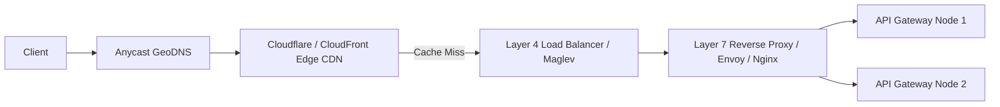

# KRUZZ — Comprehensive System Design Engineering Roadmap & Architecture Cheat-Sheet

**Version:** 3.0 (Production Master Reference)  
**Author:** KRUZZ Engineering Academy ([kruzz.dev](https://kruzz.dev))  
**Target Audience:** Software Engineers, Backend Architects, and Systems Thinkers

---

## Table of Contents

1. [What is System Design?](#1-what-is-system-design)
2. [Foundational Mental Models & Invariant Laws](#2-foundational-mental-models--invariant-laws)
3. [The Numbers Every Systems Engineer Must Know](#3-the-numbers-every-systems-engineer-must-know)
4. [Networking, Transport & Communication Protocols](#4-networking-transport--communication-protocols)
5. [Traffic Routing, Load Balancing & Edge Acceleration](#5-traffic-routing-load-balancing--edge-acceleration)
6. [Data Storage Engines, Indexing & Partitioning](#6-data-storage-engines-indexing--partitioning)
7. [Distributed Caching Architecture](#7-distributed-caching-architecture)
8. [Asynchronous Processing, Message Queues & Event Streaming](#8-asynchronous-processing-message-queues--event-streaming)
9. [Distributed Transactions, Consensus & Reliability Patterns](#9-distributed-transactions-consensus--reliability-patterns)
10. [Distributed Rate Limiting & Anti-Abuse](#10-distributed-rate-limiting--anti-abuse)
11. [Identity, Authentication & Cryptographic Verification](#11-identity-authentication--cryptographic-verification)
12. [Observability, Telemetry & The Four Golden Signals](#12-observability-telemetry--the-four-golden-signals)
13. [The 4-Step Production System Design Framework](#13-the-4-step-production-system-design-framework)
14. [Career Milestone Learning Roadmap (Level 1 to Level 4)](#14-career-milestone-learning-roadmap)
15. [KRUZZ Canonical Investigation Reference Matrix](#15-kruzz-canonical-investigation-reference-matrix)

---

## 1. What is System Design?

**System Design** is the art and engineering discipline of defining the architecture, components, modules, interfaces, and data models for a system to satisfy specified business, technical, and operational requirements.

It represents the transition from **coding in the small** to **architecting in the large**:

- **Junior Perspective:** _"How do I write a function or loop that transforms input X into output Y?"_
- **Senior Perspective:** _"How do these 12 distinct services, datastores, and message brokers communicate under a peak load of 250,000 requests per second when one datastore zone goes dark and network latency spikes by 400ms?"_

### The Three Invariant Pillars of System Architecture

1. **Scalability:** The ability of a system to handle increased load without performance degradation by adding resources (horizontal scaling > vertical scaling).
2. **Reliability:** The probability that a system performs its intended function under stated conditions for a specified period of time, tolerating hardware, software, and human failures without catastrophic outage.
3. **Maintainability:** The ease with which software can evolve, be debugged, adapted, and operated by different engineering teams over years without structural decay.

### The Law of Conservation of Complexity

> _There is no free lunch in system architecture._ Every architectural pattern that solves one problem introduces a corresponding cost:
>
> - Caching improves read latency $\longrightarrow$ introduces cache invalidation complexity and stale data risks.
> - Microservices enable independent team deployment $\longrightarrow$ introduce network partitions, distributed tracing overhead, and eventual consistency.
> - Database sharding solves write throughput $\longrightarrow$ destroys cross-shard transactions and complicates analytics.

---

## 2. Foundational Mental Models & Invariant Laws

### A. The CAP Theorem (Brewer's Theorem)

In any distributed data store, you can guarantee at most **two** out of the following three properties during network operations:

- **Consistency (Linearizability):** Every read receives the most recent write or an error.
- **Availability:** Every non-failing node returns a non-error response for every request (without guarantee it contains the most recent write).
- **Partition Tolerance:** The system continues to operate despite an arbitrary number of messages being dropped or delayed by the network between nodes.

**The Reality:** Network partitions are physical realities (fiber cuts, router reboots, GC pauses). Therefore, in real distributed systems, you must always choose **P**. Your choice is strictly:

- **CP (Consistency + Partition Tolerance):** If nodes cannot synchronize, reject writes to prevent split-brain state (e.g., PostgreSQL primary, etcd, ZooKeeper, CockroachDB).
- **AP (Availability + Partition Tolerance):** Allow nodes to accept writes independently during partition; reconcile later via vector clocks or last-write-wins (e.g., Amazon Dynamo, Cassandra, CouchDB).

### B. The PACELC Theorem (Abadi's Extension)

Extends CAP by addressing system behavior when there is **no** partition:
$$\text{If Partition (P) } \longrightarrow \text{ Choose Availability (A) or Consistency (C);}$$
$$\text{Else (E) } \longrightarrow \text{ Choose Latency (L) or Consistency (C).}$$

- **PA/EL:** High availability during partition, low latency during normal operations (e.g., DynamoDB default, Cassandra).
- **PC/EC:** Consistency prioritized at all times, accepting latency overhead for distributed consensus (e.g., Spanner, CockroachDB).

### C. Amdahl's Law & Universal Scalability Law

- **Amdahl's Law:** The speedup of a program from parallel computing is limited by the fraction of the algorithm that must run sequentially.
- **Dr. Neil Gunther's USL:** Adds the penalty of crosstalk/coherency delay between nodes:
  $$C(N) = \frac{N}{1 + \sigma(N - 1) + \kappa N(N - 1)}$$
  Where $\sigma$ is contention (queuing) and $\kappa$ is coherency delay. Past a critical node count, adding more servers actually **reduces** system throughput.

---

## 3. The Numbers Every Systems Engineer Must Know

### Latency Comparison Numbers (Jeff Dean Benchmark)

| Operation                               | Latency                 | Scaled Comparison (Human Equivalent) |
| :-------------------------------------- | :---------------------- | :----------------------------------- |
| **L1 CPU Cache Reference**              | 0.5 ns                  | 1 heart beat                         |
| **Branch Mispredict**                   | 5 ns                    | 10 seconds                           |
| **L2 CPU Cache Reference**              | 7 ns                    | 14 seconds                           |
| **Mutex Lock / Unlock**                 | 25 ns                   | 50 seconds                           |
| **Main Memory (RAM) Access**            | 100 ns                  | 3.3 minutes                          |
| **Compress 1KB with Snappy**            | 2,000 ns (2 µs)         | 1 hour                               |
| **Read 1MB sequentially from RAM**      | 250,000 ns (250 µs)     | 2.5 days                             |
| **Read 1MB sequentially from NVMe SSD** | 1,000,000 ns (1 ms)     | 10 days                              |
| **Disk Seek (Mechanical HDD)**          | 10,000,000 ns (10 ms)   | 3.8 months                           |
| **Round Trip inside same Data Center**  | 500,000 ns (0.5 ms)     | 5 days                               |
| **Round Trip: US East to US West**      | 60,000,000 ns (60 ms)   | 2 years                              |
| **Round Trip: US East to Europe**       | 150,000,000 ns (150 ms) | 5 years                              |

### Capacity Estimation Rules of Thumb

- **1 Day in Seconds:** $86,400 \approx 10^5 \text{ seconds}$ (simplifies mental division).
- **1 Million Daily Active Users (DAU) making 10 requests/day:**
  $$\frac{10,000,000 \text{ requests}}{100,000 \text{ seconds}} = 100 \text{ Requests/sec (RPS) average}.$$
  $$\text{Peak RPS } \approx 2 \times \text{ to } 3 \times \text{ average} \approx 200 - 300 \text{ RPS}.$$
- **Storage Math:**
  - $1 \text{ Byte} = 8 \text{ bits}$
  - $1 \text{ KB} = 2^{10} \approx 1,000 \text{ Bytes}$
  - $1 \text{ MB} = 2^{20} \approx 1,000,000 \text{ Bytes}$
  - $1 \text{ GB} = 2^{30} \approx 10^9 \text{ Bytes}$
  - $1 \text{ TB} = 2^{40} \approx 10^{12} \text{ Bytes}$
  - $1 \text{ PB} = 2^{50} \approx 10^{15} \text{ Bytes}$

---

## 4. Networking, Transport & Communication Protocols

```
┌─────────────────────────────────────────────────────────────┐
│                    Layer 7: Application                     │
│               HTTP/1.1, HTTP/2, HTTP/3, gRPC, WebSocket      │
├─────────────────────────────────────────────────────────────┤
│                    Layer 4: Transport                       │
│                     TCP (Reliable, Stream)                  │
│                     UDP (Fast, Datagram, QUIC)              │
└─────────────────────────────────────────────────────────────┘
```

### Protocol Comparison Matrix

| Protocol      | Transport  | Handshake                 | Multiplexing                                      | Typical Use Case                                             |
| :------------ | :--------- | :------------------------ | :------------------------------------------------ | :----------------------------------------------------------- |
| **HTTP/1.1**  | TCP        | 3-way TCP + TLS           | No (Head-of-line blocking on connection)          | Legacy web, simple CRUD APIs                                 |
| **HTTP/2**    | TCP        | 3-way TCP + TLS           | Yes (Binary streams over single TCP socket)       | Modern web applications, microservices                       |
| **HTTP/3**    | UDP (QUIC) | 1-RTT (or 0-RTT) combined | Yes (No TCP head-of-line blocking on packet drop) | High-speed mobile, modern browsers                           |
| **WebSocket** | TCP        | HTTP 101 Upgrade          | Full duplex bidirectional                         | Real-time chat, trading feeds, live collaborative cursors    |
| **gRPC**      | HTTP/2     | TCP + TLS                 | Yes (Protobuf binary serialization)               | Low-latency inter-service microservice RPC                   |
| **SSE**       | HTTP       | Standard HTTP             | One-way server push stream                        | AI completion streaming (ChatGPT/Claude), notification feeds |

---

## 5. Traffic Routing, Load Balancing & Edge Acceleration

### Load Balancing Algorithms

1. **Round Robin & Weighted Round Robin:** Distributes requests sequentially; weighted variant accounts for server hardware capacity.
2. **Least Connections:** Routes to the node with the fewest active TCP connections (ideal for long-lived WebSocket or database connections).
3. **Consistent Hashing:**
   - Map both servers and request keys (e.g., `userId` or `cacheKey`) onto a 360° circular hash ring ($2^{32} - 1$).
   - Request routes to the first server encountered clockwise.
   - **Virtual Nodes:** Each physical machine owns 100–250 virtual points on the ring to balance distribution variance.
   - **Impact:** Adding or removing a server only remaps $K/N$ keys rather than reshuffling 100% of keys.



---

## 6. Data Storage Engines, Indexing & Partitioning

### Storage Engine Trade-Offs

- **B+ Tree (PostgreSQL, MySQL InnoDB):**
  - Read-optimized ($\mathcal{O}(\log N)$ random read).
  - All data resides in leaf nodes linked horizontally, enabling efficient sequential range scans.
  - Incur write amplification due to random disk page splits.
- **LSM-Tree (Log-Structured Merge-Tree: RocksDB, Cassandra, ScyllaDB):**
  - Write-optimized ($\mathcal{O}(1)$ sequential append to memory MemTable + Write-Ahead Log).
  - Flushed sequentially to immutable SSTables on disk.
  - Compaction runs in background to merge SSTables.
  - Read penalty mitigated by Bloom Filters.

### Database Partitioning Strategies

1. **Horizontal Sharding by Key:**
   - Hash of entity key modulo $N$ ($H(userId) \pmod N$) or consistent hashing ring.
   - Avoid hotspotting (e.g., avoid partitioning by date or celebrity accounts).
2. **Range Partitioning:**
   - Partitioning by sorted key ranges (e.g., A-D, E-H). Prone to uneven load if traffic clusters on specific ranges.
3. **Directory-Based Sharding:**
   - Lookup service maintains mapping table of ID $\longrightarrow$ Shard ID. Allows flexible data migration at the cost of an extra network hop.

---

## 7. Distributed Caching Architecture

```
Client ────> [Application Node] ────> [Distributed Cache: Redis]
                     │                                 │ (Cache Miss)
                     └─────────> [Primary Database] ───┘
```

### Caching Strategies

1. **Cache-Aside (Lazy Loading):** Application first queries cache. If miss, queries database, writes result to cache with TTL, and returns. (Default for most web systems).
2. **Write-Through:** Application writes to cache; cache synchronously writes to DB before acknowledging.
3. **Write-Behind (Write-Back):** Application writes to cache; cache asynchronously writes to DB in batches. Extreme write performance; risk of data loss on cache crash.
4. **Refresh-Ahead:** Cache automatically re-fetches hot keys prior to TTL expiry based on access patterns.

### Caching Failure Modes & Defenses

- **Cache Avalanche:** Thousands of keys expire at the exact same second, flooding the database.
  - _Fix:_ Add random jitter to TTLs: `TTL = BASE_TTL + rand(0, 300)`.
- **Cache Stampede (Thundering Herd):** A single high-traffic hot key expires; 10,000 concurrent requests all miss and query DB simultaneously.
  - _Fix:_ Distributed mutex lock (Redis `SET NX EX`) so only 1 request repopulates the cache while others wait or return stale-while-revalidate data.
- **Cache Penetration:** Requests query for non-existent IDs (e.g., attacker requesting `id = -999999`), bypassing cache and hitting DB directly.
  - _Fix:_ Bloom filter at cache ingress or cache null values with short TTL.

---

## 8. Asynchronous Processing, Message Queues & Event Streaming

### Message Queue (RabbitMQ / SQS) vs Event Stream (Kafka / Kinesis)

| Feature              | Message Queue (e.g. RabbitMQ)                              | Event Log Stream (e.g. Apache Kafka)                                     |
| :------------------- | :--------------------------------------------------------- | :----------------------------------------------------------------------- |
| **Model**            | Message deleted upon consumer ACK                          | Append-only immutable commit log; messages retained for retention period |
| **Ordering**         | Per-queue ordering (can degrade with concurrent consumers) | Strict ordering guaranteed **per partition**                             |
| **Replayability**    | No (ephemeral)                                             | Yes (consumers can rewind offset to reprocess past events)               |
| **Throughput**       | 20,000 – 50,000 msgs/sec                                   | 1,000,000+ msgs/sec                                                      |
| **Consumer Scaling** | Competing consumers on single queue                        | Consumer group partitions (1 active consumer per partition)              |

---

## 9. Distributed Transactions, Consensus & Reliability Patterns

### Sagas vs Two-Phase Commit (2PC)

- **2PC (ACID across distributed nodes):** Coordinator prepares, all nodes vote, coordinator commits. Heavy coordinator lock contention, blocks resources on node network partition. Rarely used in high-scale web systems.
- **Saga Pattern (Eventual Consistency):** A sequence of local database transactions.
  - **Orchestrated:** Central workflow orchestrator directs each service and coordinates compensating rollbacks on failure.
  - **Choreographed:** Services listen to domain events and execute subsequent steps autonomously.
  - _Compensating Transactions:_ If step 4 fails, explicit undo steps (compensations) are published for steps 3, 2, and 1.

### The Circuit Breaker Pattern

Protects downstream services from cascading collapse under load:

```
           [Successes]
  ┌───────────────────────────┐
  │                           │
  ▼                           │
[CLOSED] ──(3 Failures)──> [OPEN] ──(Cooldown 5m)──> [HALF-OPEN]
                               ▲                           │
                               │        [Failure]          │
                               └───────────────────────────┘
```

---

## 10. Distributed Rate Limiting & Anti-Abuse

### Rate Limiting Algorithms

1. **Token Bucket:** Tokens added at fixed rate $r$ up to capacity $b$. Request consumes 1 token. Accommodates bursts while enforcing average rate.
2. **Leaky Bucket:** Requests enter FIFO queue and leak out at constant rate. Smooths out traffic spikes; drops overflow.
3. **Sliding Window Counter (Production Standard):**
   - Combines previous window count and current window count weighted by elapsed percentage:
     $$\text{Weight} = 1 - \frac{\text{Time into current window}}{\text{Window Size}}$$
     $$\text{Estimated Count} = (\text{Previous Window Count} \times \text{Weight}) + \text{Current Window Count}$$
   - Executed atomically in Redis via Lua scripts:
   ```lua
   -- Atomic Redis Sliding Window Evaluator
   local key = KEYS[1]
   local now = tonumber(ARGV[1])
   local window = tonumber(ARGV[2])
   local limit = tonumber(ARGV[3])

   redis.call('ZREMRANGEBYSCORE', key, 0, now - window)
   local count = redis.call('ZCARD', key)
   if count < limit then
     redis.call('ZADD', key, now, now)
     redis.call('EXPIRE', key, math.ceil(window / 1000))
     return 1
   else
     return 0
   end
   ```

---

## 11. Identity, Authentication & Cryptographic Verification

### Token Architecture

- **Stateless Tokens (JWT / PASETO):**
  - Self-contained claims signed by private asymmetric key (RS256 / Ed25519).
  - Verified by services locally using public key without database roundtrip.
  - _Revocation Challenge:_ Cannot be revoked immediately without centralized blacklist.
- **Stateful Sessions:**
  - Opaque random session identifier stored in client cookie; session record stored in Redis cluster with TTL.
  - Instant revocation on logout / compromise; requires 1 fast Redis lookup per request.

### High-Entropy Identifiers

- Avoid sequential integer IDs (`/users/12345`) in public APIs to prevent resource enumeration and scraping.
- Use cryptographically random 128-bit identifiers (e.g., `krz_` prefix + 32 hex characters) with $> 3.4 \times 10^{38}$ possibilities.

---

## 12. Observability, Telemetry & The Four Golden Signals

### The 4 Golden Signals (Google SRE Handbook)

1. **Latency:** The time it takes to service a request (differentiate successful latency vs failed latency).
2. **Traffic:** A measure of demand (e.g., HTTP requests per second, I/O bandwidth).
3. **Errors:** The rate of requests that fail (explicit 5xx errors, implicit failures, policy rejections).
4. **Saturation:** How full your service is (CPU usage, memory pressure, database connection pool exhaustion).

---

## 13. The 4-Step Production System Design Framework

Use this structured blueprint for any system design interview or architectural RFC:

### Step 1: Requirements Gathering & Scope Clarification (10 Minutes)

- **Functional Requirements:** What are the 2–3 core features that matter most? (e.g., "User can shorten URL", "User is redirected to original URL").
- **Non-Functional Requirements:** High availability vs strong consistency, latency budget (e.g., p99 < 50ms), data durability guarantees.
- **Scale Estimations:** Read/Write ratio, peak throughput (RPS), total storage over 5 years.

### Step 2: High-Level Architecture & Core APIs (15 Minutes)

- Define API endpoints with request/response schemas.
- Draw main components: Client $\longrightarrow$ CDN / Load Balancer $\longrightarrow$ API Gateway $\longrightarrow$ Microservices $\longrightarrow$ Storage & Cache.
- Establish database schema with primary and foreign keys.

### Step 3: Deep Dive into Critical Bottlenecks (15 Minutes)

- Address the hardest technical dilemma of the specific problem:
  - For URL shorteners: ID collision prevention & base62 generation.
  - For Chat: WebSocket state synchronization across horizontal gateway clusters.
  - For Payment systems: Double-charge prevention, idempotency keys, and two-phase ledger commits.

### Step 4: Scale, Fault Tolerance & Edge Cases (5 Minutes)

- What happens if the Redis cache fails?
- What happens during a cross-zone network partition?
- How do we monitor system health (SLIs, SLOs, alerts)?

---

## 14. Career Milestone Learning Roadmap

```
[Level 1: Apprentice] ──> [Level 2: Engineer] ──> [Level 3: Senior] ──> [Level 4: Staff/Principal]
```

### Level 1: Foundations (Single-Server & Modular Monoliths)

- Master relational modeling (Normal forms, B-Tree indexes, composite keys).
- Deeply understand HTTP request/response lifecycles, status codes, and TLS.
- Write thread-safe code, mutexes, atomic variables, and race condition prevention.
- Learn basic Redis cache-aside implementation.

### Level 2: Scaled Services (10,000 to 1,000,000 Users)

- Deconstruct monolith state into stateless application tiers.
- Implement read-replica databases with connection pooling (PgBouncer).
- Build asynchronous background worker architectures (Celery, BullMQ, SQS).
- Implement sliding-window rate limiters and idempotent API endpoints.

### Level 3: Distributed Systems (1,000,000 to 10,000,000 Users)

- Implement database sharding, re-sharding, and consistent hashing.
- Architect event streaming pipelines with Apache Kafka or RabbitMQ.
- Master distributed transaction rollbacks using the Saga Orchestration pattern.
- Implement Circuit Breakers, Bulkheads, and Distributed Tracing (OpenTelemetry).

### Level 4: Enterprise Scale (10,000,000+ Users & Multi-Region)

- Architect Multi-Region Active-Active deployments with conflict resolution (CRDTs).
- Evaluate and deploy distributed consensus databases (Spanner, CockroachDB).
- Optimize cost budgets, cloud egress economics, and hardware efficiency.
- Establish disaster recovery protocols, RTO (Recovery Time Objective), and RPO (Recovery Point Objective).

---

## 15. KRUZZ Canonical Investigation Reference Matrix

Practice each core architecture concept through KRUZZ's interactive cases:

| Case Study Slug                 | Architectural Focus               | Key Design Patterns Explored                                     |
| :------------------------------ | :-------------------------------- | :--------------------------------------------------------------- |
| `atm-machine`                   | Concurrency & Account Invariants  | Mutex isolation, atomic balance deduct, double-spend prevention  |
| `banking-system-transfers`      | Distributed Ledger Transactions   | Two-phase updates, deadlock avoidance, monotonic balances        |
| `client-server-architecture`    | Web Transport & Request Lifecycle | HTTP/1.1 vs 2 vs 3, DNS, socket reuse, proxy termination         |
| `password-hashing-salts`        | Cryptographic Security & Identity | bcrypt cost factors, rainbow table mitigation, salt generation   |
| `url-shortener`                 | High-Throughput Hashing & Storage | Base62 encoding, Snowflake IDs, 80/20 cache-aside strategy       |
| `realtime-chat-websocket`       | Duplex Connection Clustering      | WebSocket state, Redis Pub/Sub horizontal gateway routing        |
| `api-rate-limiting`             | Distributed Anti-Abuse & Quotas   | Token bucket vs sliding window log, atomic Redis Lua evaluation  |
| `circuit-breaker-pattern`       | Upstream Failure Isolation        | Tripped states, exponential backoff, health probe recovery       |
| `idempotent-payment-processing` | Financial Replay Protection       | Cryptographic payload hashing, unique token ledger deduplication |

---

_Generated for KRUZZ Systems Thinkers. Master the engineering trade-offs behind the world's most resilient systems at [kruzz.dev](https://kruzz.dev)._
